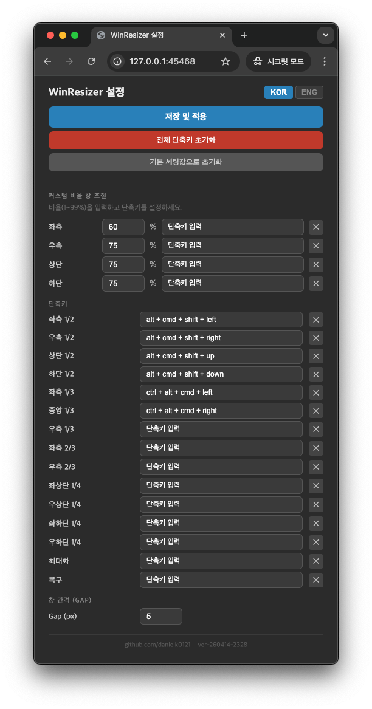

# winresizer

윈도우 창 크기 조절기 프로젝트입니다.

## 프로젝트 구조

```
winresizer/
├── app/                             # 앱 소스 및 테스트
├── doc/                             # 설계 문서 및 작업 목록 (TODO)
├── spec/                            # 요구사항 명세서
├── ref/                             # 참고 이미지 및 외부 앱 분석 자료
├── build.sh                         # .app 번들 및 DMG 빌드 스크립트
└── WinResizer.spec                  # PyInstaller 빌드 설정 (번들 구조, Info.plist 등)
```

### 주요 진입점

```
app/src/main.py          # 앱 진입점 — TrayApp 실행
app/src/tray_app.py      # macOS 메뉴바 트레이 앱 (rumps)
app/src/web_server.py    # Flask 설정 웹 서버
```

## 실행 중 프로세스 구성

앱 실행 시 **3개의 실행 단위**가 동작합니다.

| # | 프로세스 / 스레드 | 역할 | 비고 |
|---|---|---|---|
| 1 | **메인 스레드** (rumps TrayApp) | macOS 메뉴바 UI, 앱 생명주기 관리 | 메인 스레드에서 실행 — macOS AX API 호출 담당 |
| 2 | **HotkeyListenerThread** | 글로벌 키보드 단축키 감지 (pynput) | `threading.Thread` (daemon), 백그라운드 상시 대기 |
| 3 | **Flask 웹 서버 스레드** | 브라우저 기반 설정 UI 제공 | `threading.Thread` (daemon), `http://127.0.0.1:5000` |

### Flask 웹 서버 엔드포인트

| 메서드 | 경로 | 설명 |
|---|---|---|
| `GET` | `/` | 단축키/Gap 설정 페이지 (HTML), 포트는 앱 시작 시 40000번대 랜덤 할당 |
| `GET` | `/api/config` | 현재 설정값 조회 (JSON) |
| `POST` | `/api/config` | 설정 저장 및 단축키 리스너 재시작 |
| `POST` | `/api/execute` | 창 조절 명령 직접 실행 (`{"mode": "left_half"}`) |
| `GET` | `/api/execute` | 창 조절 명령 직접 실행 (`?mode=left_half`) |

### 로그 파일 경로

```
~/Library/Application Support/WinResizer/log/winresizer_YYYYMMDD_HHMMSS_KST.log
```

설정 파일(config.json) 경로:
```
~/Library/Application Support/WinResizer/config.json
```

## 데이터 플로우

### 단축키 설정 변경 시

```
브라우저 (설정 페이지)
  └─ 키 입력 감지 (JS keydown 이벤트)
       └─ POST /api/config  {"shortcuts": {...}, "settings": {"gap": 5}}
            └─ Flask 웹 서버
                 ├─ config_manager.save_config()  →  config.json 저장
                 ├─ config_manager._config_cache = None  (캐시 무효화)
                 └─ HotkeyListenerThread.stop() → 새 HotkeyListenerThread.start()
                      └─ 다음 키 입력부터 새 단축키로 동작
```

### 단축키 사용 (창 조절) 시

```
사용자 키 입력
  └─ HotkeyListenerThread (pynput 감지)
       └─ config_manager.get_config()  →  config.json에서 단축키 매핑 조회
            └─ 매핑된 mode 확인 (예: "left_half")
                 └─ execute_window_command(mode)  [메인 스레드에서 호출]
                      ├─ 현재 포커스 창 획득 (macOS AX API)
                      ├─ 모니터 정보 계산
                      └─ AXUIElement 위치/크기 설정  →  창 이동 완료
```

## 스크린샷



## 기능
- **1/2 분할**: 좌측, 우측, 상단, 하단 절반 배치
- **1/3 분할**: 좌측 1/3, 중앙 1/3, 우측 1/3 배치
- **2/3 분할**: 좌측 2/3, 우측 2/3 배치
- **1/4 분할**: 좌상단, 우상단, 좌하단, 우하단 구석 배치 (Corner Snapping)
- **특수 모드**: 최대화
- **윈도우 상태 복구**: 창 크기 조절 전 상태로 복구 (Restore)
- **멀티 모니터 지원**: 현재 활성 창이 있는 모니터 기준으로 좌표 계산

## 설치 및 실행 (Quick Guide)

### 1. 가상 환경 및 의존성 설치
본 프로젝트는 `app/venv` 폴더에 가상 환경을 구축하여 사용합니다.
```bash
# 가상 환경 생성 (이미 생성된 경우 생략 가능)
python3 -m venv app/venv

# 의존성 설치
source app/venv/bin/activate
pip install -r app/requirements.txt
```

### 2. 앱 실행
가상 환경의 파이썬 인터프리터를 사용하여 실행합니다.
```bash
app/venv/bin/python3 app/src/main.py
```

#### 실행 후 동작
- 메뉴바에 WinResizer 아이콘이 표시됩니다.
- 단축키 리스너가 백그라운드에서 즉시 시작됩니다.
- 설정 변경은 메뉴바 아이콘 클릭 → **설정 (Preferences...)** 으로 브라우저 설정 페이지를 열어 사용합니다.

### 3. 패키징 및 배포 (독립 실행형 앱)
macOS 환경에서 터미널 없이 독립적으로 실행 가능하며 접근성 권한을 앱 자체에 부여할 수 있도록 빌드할 수 있습니다.
```bash
# 앱 번들(.app) 및 DMG 생성
./build.sh
```
빌드가 완료되면 `dist/WinResizer.dmg` 파일이 생성됩니다. 이를 통해 앱을 설치하고 사용할 수 있습니다.

## 사용 가능한 단축키
기본적으로 아래의 단축키가 설정되어 있으며, 브라우저 설정 페이지(`http://127.0.0.1:5000`)에서 변경 가능합니다.
- **설정 페이지 주소**: 앱 시작 시 40000번대 랜덤 포트가 할당됩니다. 메뉴바 아이콘 → **설정 (Preferences...)** 으로 브라우저가 자동으로 열립니다.
- **단축키 변경**: 설정 페이지에서 버튼을 클릭한 후 원하는 키 조합을 입력하세요.
- **단축키 삭제(초기화)**: 단축키 녹화 중 `Backspace` 또는 `Delete` 키를 누르면 해당 단축키가 제거됩니다.

| 분류 | 기능 | 단축키 |
|---|---|---|
| **1/2 분할** | 좌측 / 우측 절반 | `⌥⌘←` / `⌥⌘→` |
| | 상단 / 하단 절반 | `⌥⌘↑` / `⌥⌘↓` |
| **1/3 분할** | 좌측 / 중앙 / 우측 1/3 | (GUI 설정 필요) |
| **2/3 분할** | 좌측 / 우측 2/3 | (GUI 설정 필요) |
| **1/4 분할** | 좌상 / 우상 / 좌하 / 우하 | (GUI 설정 필요) |
| **기타** | 최대화 / 복구(Restore) | (GUI 설정 필요) |

## 필수 권한 설정 (macOS)
앱이 정상적으로 창을 제어하기 위해 다음 권한 허용이 필요합니다:
1. **시스템 설정 > 개인정보 보호 및 보안 > 손쉬운 사용 (Accessibility)**: 실행 중인 앱(예: 터미널) 권한 허용.
2. **시스템 설정 > 개인정보 보호 및 보안 > 입력 모니터링 (Input Monitoring)**: 백그라운드 키보드 감지를 위해 권한 허용.
